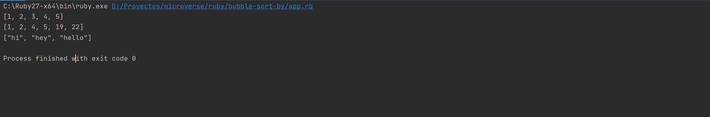

# bubble-sort-by

> This is a solution to [The project bubble sort assignment](https://www.theodinproject.com/courses/ruby-programming/lessons/bubble-sort). 

This is a microverse approach to solving and adding an extra feature to the bubble sort algorithm

## Built With

- Ruby

## Getting Started

- Run this command in your OS terminal: `git clone https://github.com/JuanDavid31/bubble-sort-by.git` to get a copy of the project.
- Open a terminal in the project folder and run `ruby app.rb`.

### Prerequisites

* Internet connection
* Having Ruby installed on you OS

### Setup

* Clone the repository

### Usage

* Execute the `app.rb` file

## Authors

👤 **Author1**

- GitHub: [JuanDavid31](https://github.com/JuanDavid31)

👤 **Author2**

- GitHub: [ccobasi](https://github.com/ccobasi)

## 🤝 Contributing

Contributions, issues, and feature requests are welcome!

Feel free to check the [issues page](https://github.com/JuanDavid31/tnw-clone/issues).

## Show your support

Give a ⭐️ if you like this project!

## Acknowledgments

- To developers

## 📝 License

This project is [MIT](https://es.wikipedia.org/wiki/Licencia_MIT) licensed.